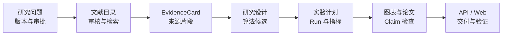

# 研迹 ScholarTrace

[](https://github.com/chugwei/ScholarTrace/actions/workflows/quality.yml)
[](https://www.python.org/)
[](LICENSE)

**把研究问题、文献证据、实验记录和论文主张连成一条可审计链路。**

ScholarTrace 是一个本地优先的科研工作台，面向需要长期迭代、人工审批和来源追溯的研究项目。它用版本化领域对象保存“问题如何形成、证据来自哪里、实验如何执行、结论由什么支持”，并通过 CLI、FastAPI 和轻量 Web 工作台提供统一入口。

项目优先解决科研过程的可追溯性与可复现性，而不是自动生成未经验证的科研结论。LLM 输出、合成样例和离线演示只能作为候选或工程验证，不能替代真实数据、来源核验与研究者审批。

## 核心能力

- **研究问题与人工门禁**：基于 LangGraph + SQLite Checkpoint 保存项目状态，支持暂停、恢复、批准、拒绝、修改、版本冻结和回滚审计。
- **文献与证据链**：管理本地 PDF 和元数据，提供 SHA-256 去重、Crossref/OpenAlex 查询降级、项目级文献审核、Chunk 检索与可定位的 EvidenceCard。
- **研究设计与实验追踪**：版本化 Pipeline、数据采集协议、算法候选与 ExperimentPlan；保存 Run Manifest、数据/代码版本、独立重算指标和 Claim 证据状态。
- **受控运行与产物复现**：使用 argv 白名单、超时、取消、事件日志和失败隔离运行实验；图表可从已验证指标重建为 PNG、SVG 和 PDF。
- **论文契约与引用检查**：管理 Manuscript、Section Contract 和 Claim Ledger，执行离线 BibTeX 解析、引用缺失检查、数字一致性与来源回溯门禁。
- **本地服务与交付边界**：提供 FastAPI、SSE 时间线和 Web 工作台；源码开发分支还包含 Manifest 绑定推理、交付清单校验、Compose staging、健康探针与受验证回滚。

## 快速开始

### 1. 安装

需要 Python 3.12+、[uv](https://docs.astral.sh/uv/) 和 Git。

```bash
git clone https://github.com/chugwei/ScholarTrace.git
cd ScholarTrace
uv sync --all-groups
```

### 2. 启动 Web 工作台

```bash
uv run scholartrace web
```

打开 <http://127.0.0.1:8000>。默认业务数据库和 LangGraph checkpoint 保存在已忽略的 `.scholartrace/` 目录中。

### 3. 使用 CLI 创建可恢复项目

仓库提供一个农业视觉研究问题样例，可直接用于离线体验：

```bash
uv run scholartrace project create agriculture-demo \
  --question-file examples/agriculture-vision-project/research-question.json

uv run scholartrace project show agriculture-demo
uv run scholartrace project continue agriculture-demo
```

PowerShell 可将续行符 `\` 改为反引号，或把命令写在同一行。完整参数与离线推理示例见 [CLI 文档](docs/cli.md)。

## 工作方式



每个阶段都保留版本、状态和来源关系；需要正式发布的研究对象必须经过人工门禁。SQLite 保存领域记录，LangGraph Checkpoint 保存流程状态，文件产物通过相对路径和 SHA-256 与记录绑定。详细设计见 [架构说明](docs/architecture.md)。

## 当前状态

最新稳定 Tag 为 [`v0.11.0`](https://github.com/chugwei/ScholarTrace/releases/tag/v0.11.0)，包含本地 Web 工作台、Project/Run/Artifact API 和 SSE 事件时间线。当前源码开发继续完善交付验证与部署边界；具体实现、可复现测试和未完成项以 [实施状态](IMPLEMENTATION_STATUS.md) 为准。

以下内容尚不能从仓库中的合成或离线测试推导出来：

- 真实农业视觉模型的效果与泛化能力；
- 真实文献语义召回质量或创新性结论；
- 真实数据采集、生产部署、现场验证与论文投稿结果；
- 任何未经来源核验和人工审批的 LLM 生成结论。

`examples/` 和 `tests/fixtures/` 中的内容均为合成、脱敏或离线契约样例，不是科研证据。项目对证据等级和研究真实性的完整约束见 [科研真实性说明](docs/research-integrity.md)。

## 质量验证

运行与 CI 一致的统一门禁：

```bash
uv run python scripts/check.py
```

也可以分别运行：

```bash
uv run ruff format --check src tests scripts
uv run ruff check src tests scripts
uv run pytest
uv run python scripts/validate_fixtures.py
```

## 项目结构

```text
src/scholartrace/   核心领域、流程、持久化、API 与 CLI
tests/              单元、集成和端到端测试
examples/           合成研究场景与交付契约样例
docs/               架构、ADR、真实性规则与验证记录
deployment/         本地 staging/Compose 说明
scripts/            统一质量门禁与 Fixture 校验
```

## 文档

- [产品范围与非目标](docs/product-scope.md)
- [架构说明](docs/architecture.md)
- [CLI 使用指南](docs/cli.md)
- [公开路线图](docs/roadmap.md)
- [需求追溯矩阵](docs/traceability-matrix.md)
- [变更记录](CHANGELOG.md)
- [贡献指南](CONTRIBUTING.md)

## 贡献

欢迎提交 Issue 和 Pull Request。开始前请阅读 [CONTRIBUTING.md](CONTRIBUTING.md)，并确保新增能力同时包含测试、来源边界与必要文档。请勿提交真实私有数据、论文全文、凭据、数据库、模型权重或大型运行产物。

## 许可证

本项目采用 [Apache License 2.0](LICENSE)。
